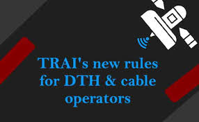
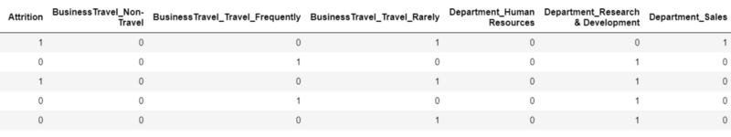
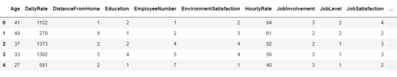
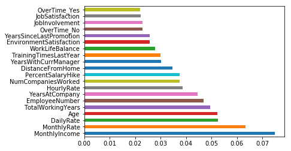

# IMPACT ANALYSIS OF COST OF CABLE(DTH) FEES

## INTRODUCTION
The Telecom Regulatory Authority of India (TRAI) recently drafted new regulations and directed various DTH service providers and operators to implement them. These regulations were set up to ensure all operators in the DTH and cable ecosystem get a fair share of earnings. 
The immediate benefit will be passed to consumers as they get to choose what they want to watch and pay for it accordingly. The new plans are already in existence since February 1, 2019.

Though TRAI’s intent was to provide benefits to the Consumer, Service Providers and Broadcasters, but there has been a growing concern from the consumers around the increased cost of cable fees which they have to pay under the new cost structure.

-__Key concern :__ Why do we have to pay more now? 
  - It is estimated that the average cable fees was around 250 Rs where an consumer was able to watch all the channels. But now, consumers are complaining that now they have to more 2 to 4 times more for the same choice. 
  - Is this a fair deal?

An analysis was done on the Master Channel list to see what offerings are available in Pay and Free channels. And also to test TRAIs few recommendations like choosing your channels wisely and limited to 50 channels (as the survey suggests "around 90% of an average viewer does not watch more than 50 channels") and verify the below 2 primary concerns (by studying sample data - using live user selection), 
- can we beat (250 Rs) as this is the benchmark consumers have set(this is cable fee that they used pay)?
- Is it going to cost 2-4 times more as most of consumers fear?

## DATA
| Column Name         | Description                                               |
| ------------------- |:-------------                                            :| 
| Pack_Name           | Channel Name                                              | 
| Pack_Value          | Monthly Cost                                              |  
| Monthly_Cost_in_Rs  | Cost per month                                            | 
| Choose_Yes_No       | Wishlist selection                                        |   
| Channel_Genre       | Genre - movies,music,sports,infotainment etc              |
| Channel_Language    | Primary Language                                          |
| Channel_Type        | Standard Definition(SD) or High Definition(HD)            |

## PROJECT ANALYSIS
| Description | Analysis |
| --- | --- |
| hr_data.head |  |
| dummies |  |
| final |  |

### FEATURE IMPORTANCE

- We saw how we can avoid using correlated values and why it is important not to use those while modelling. 
- We used Random forest and learned how it can be very advantageous over other available machine learning algorithm. 
- Most of all we found factors which are most important to employees and if are not fulfilled might lead to Attrition.

[Jupyter Notebook](./HR_Analytics.ipynb)

